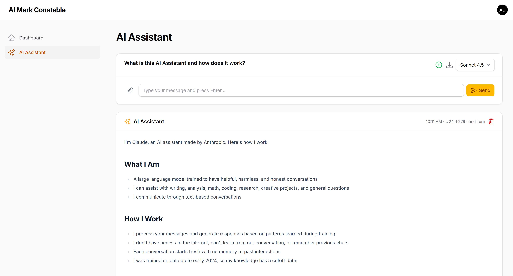

# AI Assistant for Laravel + Filament

A drop-in AI chat assistant package for Laravel 12 and Filament 5, powered by Anthropic's Claude API. Provides a full-featured chat interface with conversation history, image attachments, model switching, token tracking, and tool/function calling — all inside your Filament admin panel.



## Features

- Multi-turn chat with persistent conversation history
- Image attachments with Claude vision (JPEG, PNG, GIF, WebP)
- Model switching — Haiku 4.5, Sonnet 4.5, Opus 4.6
- Token usage tracking (input/output) and stop reason display
- Chat export to Markdown
- Message deletion with automatic attachment cleanup
- Tool/function calling support
- Streaming responses (optional)
- Livewire 4 real-time updates
- Filament 5 admin panel integration
- Standalone `<livewire:ai-assistant::chat-box />` component
- Publishable config, views, and migrations

## Requirements

- PHP 8.1+
- Laravel 10+ / 11+ / 12+
- Filament 4+ / 5+
- Livewire 3+ / 4+
- An [Anthropic API key](https://console.anthropic.com/)

## Quick Start (This Demo App)

Clone and run this repository to see the package in action:

```bash
git clone https://github.com/markc/aimc.git
cd aimc
composer setup
```

Add your API key to `.env`:

```env
ANTHROPIC_API_KEY=sk-ant-api03-xxxxx
```

Start the dev server:

```bash
composer dev
```

Visit `http://localhost:8000/admin`, register a user, and navigate to **AI Assistant**.

---

## Reusing the Package in Any Laravel + Filament Project

The reusable package lives in `packages/ai-assistant/`. Follow these steps to add it to your own project.

### Step 1: Copy the Package

```bash
cp -r packages/ai-assistant /path/to/your-project/packages/
```

### Step 2: Register the Path Repository

Add to your project's `composer.json`:

```json
{
    "repositories": [
        {
            "type": "path",
            "url": "packages/ai-assistant"
        }
    ],
    "require": {
        "markc/ai-assistant": "@dev"
    }
}
```

Then install:

```bash
composer update markc/ai-assistant
```

The service provider auto-registers via Laravel's package discovery.

### Step 3: Environment Variables

Add to your `.env`:

```env
ANTHROPIC_API_KEY=sk-ant-api03-xxxxx
ANTHROPIC_MODEL=claude-sonnet-4-5-20250929
ANTHROPIC_MAX_TOKENS=4096
ANTHROPIC_SYSTEM_PROMPT="You are a helpful assistant."
```

### Step 4: Run Migrations

```bash
php artisan migrate
```

This creates two tables:

| Table | Purpose |
|-------|---------|
| `ai_conversations` | Stores conversations per user (title, model, system prompt, metadata) |
| `ai_messages` | Stores messages per conversation (role, content, attachments, tokens) |

### Step 5: Create the Storage Symlink

Required for image attachments:

```bash
php artisan storage:link
```

### Step 6: Register the Filament Page

In your `AdminPanelProvider.php`:

```php
use Markc\AiAssistant\AiAssistantServiceProvider;

public function panel(Panel $panel): Panel
{
    return $panel
        // ...existing config...
        ->pages([
            Pages\Dashboard::class,
            AiAssistantServiceProvider::getFilamentPage(),
        ]);
}
```

That's it. The AI Assistant page appears in your Filament sidebar.

---

## Configuration

Publish the config file for full control:

```bash
php artisan vendor:publish --tag=ai-assistant-config
```

This creates `config/ai-assistant.php`:

```php
return [
    'api_key' => env('ANTHROPIC_API_KEY'),
    'model' => env('ANTHROPIC_MODEL', 'claude-sonnet-4-5-20250929'),
    'max_tokens' => env('ANTHROPIC_MAX_TOKENS', 4096),
    'system_prompt' => env('ANTHROPIC_SYSTEM_PROMPT', 'You are a helpful assistant.'),

    'navigation' => [
        'icon' => 'heroicon-o-sparkles',
        'label' => 'AI Assistant',
        'group' => null,
        'sort' => 100,
    ],
];
```

## Customization

### Publish Views

```bash
php artisan vendor:publish --tag=ai-assistant-views
```

Views are copied to `resources/views/vendor/ai-assistant/` for editing.

### Navigation

Change the sidebar icon, label, group, or sort order in `config/ai-assistant.php`:

```php
'navigation' => [
    'icon' => 'heroicon-o-chat-bubble-left-right',
    'label' => 'Chat with AI',
    'group' => 'Tools',
    'sort' => 50,
],
```

### System Prompt

Set per-app behavior via `.env`:

```env
ANTHROPIC_SYSTEM_PROMPT="You are a customer support agent for Acme Corp. Be concise and professional."
```

---

## Using the Chat Component Standalone

The Livewire component works outside Filament in any Blade view:

```blade
<livewire:ai-assistant::chat-box />
```

With a specific conversation:

```blade
<livewire:ai-assistant::chat-box :conversation-id="$conversationId" />
```

## Using the AnthropicService Directly

Inject or resolve the service for programmatic use:

```php
use Markc\AiAssistant\Services\AnthropicService;

$ai = app(AnthropicService::class);

// Simple chat
$response = $ai->chat([
    ['role' => 'user', 'content' => 'Explain Laravel service providers.']
]);

// Switch model
$ai->setModel('claude-haiku-4-5-20251001');

// Custom system prompt
$ai->setSystemPrompt('You are a senior Laravel developer.');
$response = $ai->chat($messages);

// Token usage
$tokens = $ai->getTokenUsage(); // ['input' => ..., 'output' => ...]
```

### Tool/Function Calling

Register tools that Claude can invoke during a conversation:

```php
$ai->registerTool(
    name: 'get_weather',
    description: 'Get the current weather for a location',
    inputSchema: [
        'type' => 'object',
        'properties' => [
            'location' => ['type' => 'string', 'description' => 'City name'],
        ],
        'required' => ['location'],
    ],
    handler: fn($input) => "Weather in {$input['location']}: Sunny, 25°C"
);

$response = $ai->chat([
    ['role' => 'user', 'content' => 'What is the weather in Sydney?']
]);
```

### Streaming

For long responses, use the generator-based streaming API:

```php
foreach ($ai->stream($messages) as $chunk) {
    echo $chunk;
}
```

---

## Architecture

```
packages/ai-assistant/
├── composer.json                  # Package metadata & dependencies
├── config/
│   └── ai-assistant.php           # Publishable configuration
├── database/migrations/
│   └── create_ai_assistant_tables.php
├── resources/views/
│   ├── filament/pages/
│   │   └── ai-assistant.blade.php # Filament page layout
│   └── livewire/
│       └── chat-box.blade.php     # Chat UI component
└── src/
    ├── AiAssistantServiceProvider.php  # Auto-discovery, bindings, publishing
    ├── Filament/Pages/
    │   └── AiAssistant.php             # Filament admin page
    ├── Livewire/
    │   └── ChatBox.php                 # Chat logic (send, delete, export)
    ├── Models/
    │   ├── Conversation.php            # User conversations with API formatting
    │   └── Message.php                 # Individual messages with metadata
    └── Services/
        └── AnthropicService.php        # Claude API wrapper (chat, stream, tools)
```

### How It Works

1. **AiAssistantServiceProvider** registers the `AnthropicService` as a singleton, loads migrations and views, and exposes publishable assets.
2. **AiAssistant** (Filament Page) provides the admin panel page with a conversation sidebar showing the 20 most recent chats.
3. **ChatBox** (Livewire Component) handles the real-time chat UI — sending messages, uploading images, switching models, and exporting conversations.
4. **AnthropicService** wraps the Anthropic PHP SDK with convenience methods for chat, streaming, tool registration, and token tracking.
5. **Conversation** and **Message** models persist chat history with full metadata (tokens, stop reason, attachments, tool calls).

### Database Schema

**ai_conversations** — one per chat session, scoped to the authenticated user:
- `user_id`, `title`, `model`, `system_prompt`, `metadata`

**ai_messages** — one per message within a conversation:
- `conversation_id`, `role` (user/assistant), `content`, `attachments` (JSON), `tool_calls` (JSON), `tool_results` (JSON), `input_tokens`, `output_tokens`, `stop_reason`

---

## Development

```bash
composer setup    # Install deps, generate key, migrate, build assets
composer dev      # Start dev server + queue + logs + Vite
composer test     # Run PHPUnit tests
```

## License

MIT
